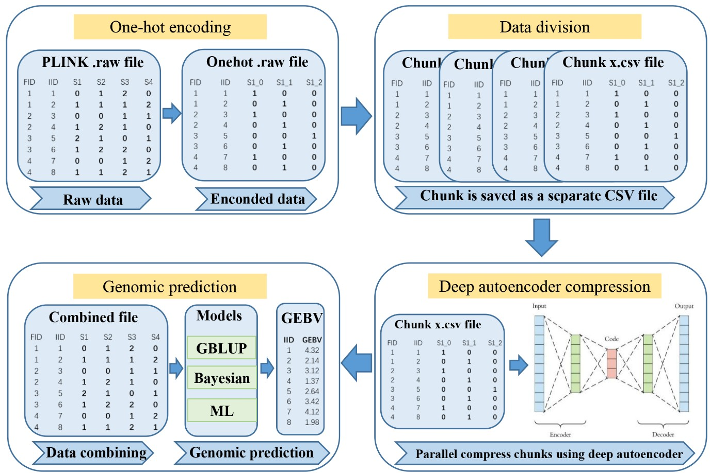

# DAGP
* A deep autoencoder compression-based genomic prediction method for whole-genome sequencing data.
* This script executes the DAGP method, including genotype one-hot encoding, data division, data combining, and genomic prediction using GBLUP, Bayesian, and machine learning methods.
* This script will store the results in a text file, including prediction accuracy, unbiasedness, mse and mae.  

# Requirements
* R 3.6.3 or higher
* Python 3.7.0 or higher
* DMU v6

# Usage
```
./DAGP.sh pruned.raw id.txt rel.txt val.txt
```
## Description of arguments
* pruned.raw  
Genotype file: PLINK-format genotype file encoded in 012 (0=homozygous reference, 1=heterozygous, 2=homozygous alternate).
```
FID	IID	PAT	MAT	SEX	PHENOTYPE	SNP1	SNP2	SNP3
174	174	0	0	0	-9	0	2	1
175	175	0	0	0	-9	0	0	2
176	176	0	0	0	-9	0	2	0
177	177	0	0	0	-9	0	1	0
178	178	0	0	0	-9	1	0	2
179	179	0	0	0	-9	1	0	1
180	180	0	0	0	-9	0	1	1
```
* id.txt  
A single-column file listing sample IDs in the same order as pruned.raw.
```
174
175
176
177
178
179
180
181
182
183
184
185
```
* rel.txt  
Contains reference population IDs paired with their corresponding phenotypic values.
```
174 0.192539683
175 0.135280899
176 0.158791209
177 0.093942308
178 0.07625
179 0.104366197
180 0.103037975
181 0.0863
182 0.075
184 0.0971875
185 0.133222222
```
* val.txt  
Includes validation population IDs and their associated phenotypes for evaluation.
```
183 0.1053
190 0.118267717
191 0.14606383
194 0.074
204 0.087391304
208 0.172359551
115 0.2007
122 0.1141
149 0.1554
154 0.4392
166 0.1845
```
## output file
* GBLUP.txt       # Accuracy (corr), unbiasedness (reg), mse (MSE) and mae (MAE) of prediction using GBLUP
* BayesA.txt      # Accuracy (corr), unbiasedness (reg), mse (MSE) and mae (MAE) of prediction using BayesA
* BayesB.txt      # Accuracy (corr), unbiasedness (reg), mse (MSE) and mae (MAE) of prediction using BayesB
* BayesCpi.txt    # Accuracy (corr), unbiasedness (reg), mse (MSE) and mae (MAE) of prediction using BayesCpi
* BayesLasso.txt  # Accuracy (corr), unbiasedness (reg), mse (MSE) and mae (MAE) of prediction using BayesLasso
* SVR.txt         # Accuracy (corr), unbiasedness (reg), mse (MSE) and mae (MAE) of prediction using SVR
* RF.txt          # Accuracy (corr), unbiasedness (reg), mse (MSE) and mae (MAE) of prediction using RF
* KRR.txt         # Accuracy (corr), unbiasedness (reg), mse (MSE) and mae (MAE) of prediction using KRR
* XGB.txt         # Accuracy (corr), unbiasedness (reg), mse (MSE) and mae (MAE) of prediction using XGB
* Net_1_CompressedData.csv  #Compressed genotype file.
## Script Description
The folder bin contains the following scripts:
* DataProcessing012_fast.py is a Python script that performs one-hot encoding and data division on genotype files.
* Net_1_slurm.py is a Python script that uses deep autoencoder compression to process genotype files.
* jobs_Net_1.sh is a script that uses SLURM to run deep autoencoder compression in parallel.
* combine.py is a script that merges compressed genotype files into a single genotype file.
* G.R is an R script that constructs the G matrix from compressed genotype files.
* Gma_to_3lineID.py is a Python script that converts the G matrix file into a three-column format.
* GINV.py is a Python script that computes the inverse of the G matrix.
* GBLUP.DIR is a DMU driver file for GBLUP method.
* r_dmuai, dmu1 and dmuai are the modules of DMU software.
* gebv.py is a python code that extracts the GEBV of the GBLUP method.
* COR_REG_used2.py is a python code that calculates accuracy, unbiasedness, mse, and mae.
* pickdata2.py is a Python script that extracts data from genotype files.
* BayesA.R, BayesB.R, BayesC.R, and BayesBL.R are R scripts that run the BayesA, BayesB, BayesCpi, and BayesLasso methods, respectively.
* picktbv.py is a Python script that extracts GEBV (Genomic Estimated Breeding Values).
* CommML.py is a Python script that runs machine learning methods.

The folder data contains the following files:
* pruned.raw, id.txt, rel.txt, and val.txt are example files used for running DAGP method.

